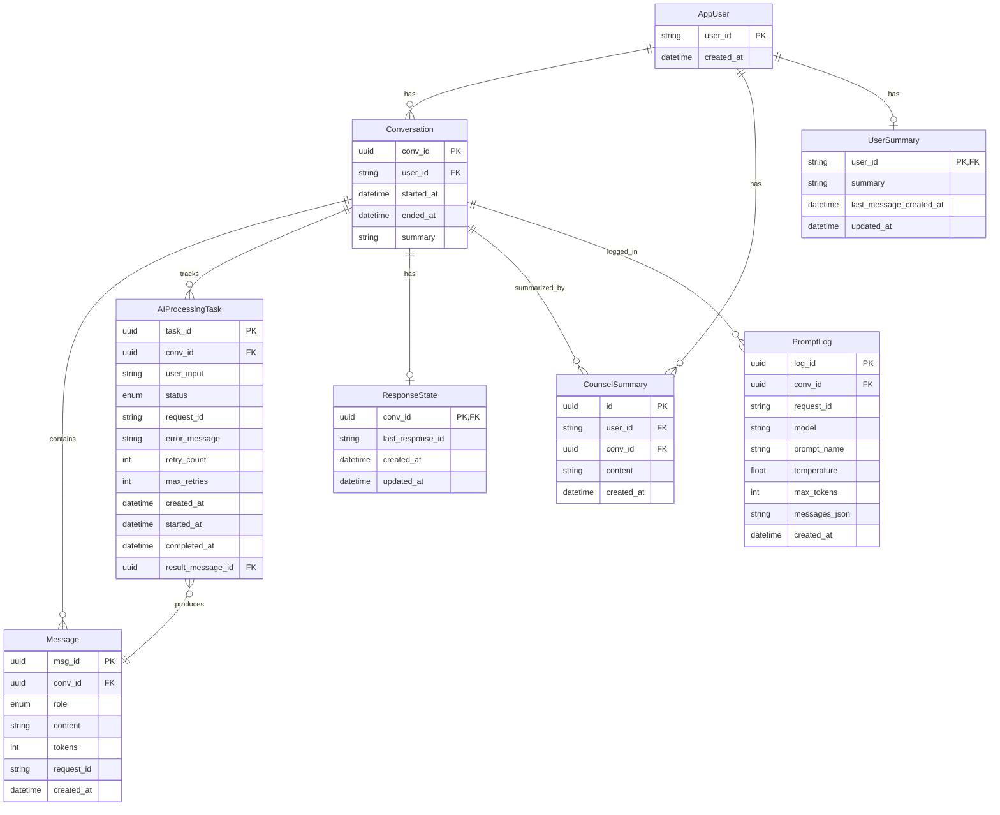

## 데이터베이스 스키마 상세 문서

본 문서는 현재 코드(`app/database/models.py`, `app/database/db.py`)를 기준으로 실제 운용 중인 DB 스키마, 컬럼/인덱스/제약, 테이블 간 관계, 처리 흐름, 샘플 쿼리, 운영 팁을 일괄 정리합니다.

### 개요

- **ORM/엔진**: SQLModel + SQLAlchemy AsyncEngine
- **세션 관리**: `AsyncSession` (expire_on_commit=False, autoflush=False, autocommit=False)
- **테이블 생성**: `init_db()`에서 `SQLModel.metadata.create_all`
- **풀 설정**: `pool_pre_ping`, `pool_size=10`, `max_overflow=20`, `pool_timeout=30s`, `pool_recycle=3600s`, `pool_reset_on_return='commit'`

---

## 열거형(Enums)

- **MessageRole**: `user` | `assistant` | `system`
- **AIProcessingStatus**: `pending` | `processing` | `completed` | `failed`

---

## 테이블 사양

### 1) AppUser

- **목적**: 외부(카카오 등)에서 전달된 사용자 식별자를 서비스 내부에서 일관 관리
- **컬럼**
  - `user_id` (PK, str, not null)
  - `created_at` (datetime, default: `utcnow()`)
- **인덱스/제약**: PK(`user_id`)
- **관계**: `AppUser (1) — (N) Conversation`, `AppUser (1) — (N) CounselSummary`

### 2) Conversation

- **목적**: 사용자별 대화 세션(묶음) 관리. 요약/시작/종료 시각 보관
- **컬럼**
  - `conv_id` (PK, UUID, default: `uuid4()`)
  - `user_id` (FK -> `appuser.user_id`, not null, indexed)
  - `started_at` (datetime, default: `utcnow()`, indexed)
  - `ended_at` (datetime, nullable)
  - `summary` (str, nullable)
- **인덱스/제약**: FK(`user_id`), Index(`user_id`, `started_at`)
- **관계**: `Conversation (1) — (N) Message`, `Conversation (1) — (N) AIProcessingTask`, `Conversation (1) — (1) ResponseState`, `Conversation (1) — (N) CounselSummary`, `Conversation (1) — (N) PromptLog`

### 3) Message

- **목적**: 대화의 개별 발화 로그(유저/어시스턴트/시스템)
- **컬럼**
  - `msg_id` (PK, UUID, default: `uuid4()`)
  - `conv_id` (FK -> `conversation.conv_id`, not null, indexed)
  - `role` (enum MessageRole, not null, indexed)
  - `content` (str, not null)
  - `tokens` (int, nullable)
  - `request_id` (str, nullable, indexed)
  - `created_at` (datetime, default: `utcnow()`, indexed)
- **인덱스/제약**: FK(`conv_id`), Index(`conv_id`, `role`, `created_at`, `request_id`)
- **관계**: `Message (0..1) — (1) AIProcessingTask.result_message_id`에 의해 역참조 가능

### 4) AIProcessingTask

- **목적**: 비동기 AI 처리(큐잉/재시도/콜백) 상태 관리
- **컬럼**
  - `task_id` (PK, UUID, default: `uuid4()`)
  - `conv_id` (FK -> `conversation.conv_id`, not null, indexed)
  - `user_input` (str, not null)
  - `status` (enum AIProcessingStatus, default: `pending`, indexed)
  - `request_id` (str, nullable, indexed)
  - `error_message` (str, nullable)
  - `retry_count` (int, default: 0)
  - `max_retries` (int, default: 3)
  - `created_at` (datetime, default: `utcnow()`, indexed)
  - `started_at` (datetime, nullable)
  - `completed_at` (datetime, nullable)
  - `result_message_id` (UUID, nullable, FK -> `message.msg_id`)
- **인덱스/제약**: FK(`conv_id`), FK(`result_message_id`), Index(`status`, `request_id`, `created_at`)
- **상태 전이**: `pending → processing → completed` 또는 `pending/processing → failed` (재시도 시 `retry_count` 증가)

### 5) PromptTemplate

- **목적**: 프롬프트 템플릿(시스템/유저 템플릿) 버전/활성 관리
- **컬럼**
  - `prompt_id` (PK, UUID, default: `uuid4()`)
  - `name` (str, not null, indexed)
  - `version` (int, default: 1, indexed)
  - `system_prompt` (str, not null)
  - `user_prompt_template` (str, nullable)
  - `is_active` (bool, default: true, indexed)
  - `description` (str, nullable)
  - `created_at` (datetime, default: `utcnow()`, indexed)
  - `created_by` (str, nullable)
- **인덱스/제약**: Index(`name`, `version`, `is_active`, `created_at`)
- **비고**: `created_by`는 FK 아님(자유 텍스트)

### 6) ResponseState

- **목적**: 대화별 OpenAI Responses API의 마지막 `response_id` 저장
- **컬럼**
  - `conv_id` (PK, UUID, FK -> `conversation.conv_id`)
  - `last_response_id` (str, nullable)
  - `created_at` (datetime, default: `utcnow()`)
  - `updated_at` (datetime, nullable)
- **인덱스/제약**: PK가 동시에 FK. 1:1로 `Conversation`과 매핑

### 7) CounselSummary

- **목적**: 상담(대화) 요약 콘텐츠를 별도 테이블에 보관
- **컬럼**
  - `id` (PK, UUID, default: `uuid4()`)
  - `user_id` (str, FK -> `appuser.user_id`, indexed)
  - `conv_id` (UUID, FK -> `conversation.conv_id`, indexed)
  - `content` (str, not null)
  - `created_at` (datetime, default: `utcnow()`, indexed)
- **인덱스/제약**: FK(`user_id`, `conv_id`), Index(`user_id`, `conv_id`, `created_at`)
- **관계**: 한 대화에 요약이 여러 번 저장될 수 있음(버전 이력 용도)

### 8) PromptLog

- **목적**: 모델 호출 시점의 최종 메시지 배열 및 파라미터를 원본 그대로 감사(Audit) 로그로 저장
- **컬럼**
  - `log_id` (PK, UUID, default: `uuid4()`)
  - `conv_id` (UUID, nullable, FK -> `conversation.conv_id`, indexed)
  - `request_id` (str, nullable, indexed)
  - `model` (str, nullable)
  - `prompt_name` (str, nullable)
  - `temperature` (float, nullable)
  - `max_tokens` (int, nullable)
  - `messages_json` (str, not null) — 직렬화된 JSON 문자열
  - `created_at` (datetime, default: `utcnow()`, indexed)
- **인덱스/제약**: Index(`conv_id`, `request_id`, `created_at`)
- **비고**: 대화 외 글로벌 호출도 저장 가능하도록 `conv_id`는 nullable

---

### 9) UserSummary

- **목적**: 사용자 단위로 누적 요약을 유지하고, 마지막 요약 반영 시점을 기록해 윈도우 롤업(20턴 등)을 관리
- **컬럼**
  - `user_id` (PK, FK -> `appuser.user_id`)
  - `summary` (str, nullable)
  - `last_message_created_at` (datetime, nullable)
  - `updated_at` (datetime, default: `utcnow()`)
- **관계/인덱스**: PK가 FK, 1:1로 `AppUser`와 매핑

---

## 테이블 관계(ER 다이어그램)



---

## 처리 흐름 요약

### A) 동기(즉시) 응답 경로
1. `/skill` 요청 수신 → `user_id`, `utterance` 파싱
2. `AppUser` upsert → 기존/신규 `Conversation` 확보
3. 시간 예산 내 모델 호출 시도 → 성공 시 즉시 응답 반환
4. `Message(user)`와 `Message(assistant)`를 백그라운드 태스크로 저장
5. 에러 또는 DB 장애 시에도 사용자 응답은 유지(로그/후처리)

### B) 콜백 경로(ENABLE_CALLBACK=True & 시간 부족)
1. 제한시간 내 미완료 → `{ "version":"2.0", "useCallback": true }` 즉시 반환
2. 백그라운드에서 모델 호출, `Message(assistant)` 저장
3. 콜백 HTTP POST로 최종 응답 전달
4. 상태 추적은 `AIProcessingTask.status`와 `request_id`로 트래킹

---

## 샘플 쿼리/패턴

> 아래는 SQLModel/SQLAlchemy로 표현되는 동작의 의사 코드입니다.

### 1) 대화 시작/메시지 기록
```python
# AppUser upsert (존재 시 skip)
session.add(AppUser(user_id=user_id))

# Conversation 생성 또는 조회
conv = Conversation(user_id=user_id)
session.add(conv)
await session.flush()  # conv_id 확보

# 유저 메시지 기록
session.add(Message(conv_id=conv.conv_id, role=MessageRole.USER, content=utterance))
```

### 2) 비동기 작업 생성/완료 처리
```python
# 작업 생성(pending)
task = AIProcessingTask(conv_id=conv.conv_id, user_input=utterance)
session.add(task)

# 처리 시작 → 완료 시 결과 메시지 연결
assistant_msg = Message(conv_id=conv.conv_id, role=MessageRole.ASSISTANT, content=answer)
session.add(assistant_msg)
await session.flush()  # msg_id 확보

task.status = AIProcessingStatus.COMPLETED
task.result_message_id = assistant_msg.msg_id
```

### 3) 대화별 마지막 response_id 관리
```python
state = await session.get(ResponseState, conv.conv_id)
if not state:
    session.add(ResponseState(conv_id=conv.conv_id, last_response_id=response_id))
else:
    state.last_response_id = response_id
    state.updated_at = datetime.utcnow()
```

### 4) 감사 로그 저장
```python
session.add(PromptLog(
    conv_id=conv.conv_id,
    request_id=request_id,
    model=model,
    prompt_name=prompt_name,
    temperature=temperature,
    max_tokens=max_tokens,
    messages_json=json.dumps(messages, ensure_ascii=False),
))
```

### 5) 상담 요약 저장
```python
session.add(CounselSummary(
    user_id=user_id,
    conv_id=conv.conv_id,
    content=summary_text,
))
```

---

## 성능/운영 노트

- **인덱스 활용**: 질의 패턴에 따라 `created_at`, `request_id`, `status`, `user_id` 복합 인덱스를 적극 활용
- **장애 내성**: DB 오류 시 사용자 응답을 우선. 실패한 기록은 재처리 큐 또는 운영 로그로 보전
- **세션 수명**: 요청/백그라운드 태스크 각각 독립 `AsyncSession` 사용 권장
- **보존 정책**: `PromptLog`, `Message`는 용량 증가속도가 빠름. 파티셔닝 또는 주기적 보관/삭제 정책 고려
- **호환성**: DB 벤더에 따라 enum/uuid가 네이티브/텍스트로 저장될 수 있음. 마이그레이션 시 주의

---

## 초기화/세션 관리 참고(`app/database/db.py`)

- `create_async_engine(settings.database_url, pool_pre_ping=True, pool_size=10, max_overflow=20, ...)`
- `init_db()`에서 테이블 자동 생성
- `get_session()` 제너레이터로 안전한 세션 획득/반환/rollback 보장

---

문의/개선 제안은 문서 PR로 환영합니다.

