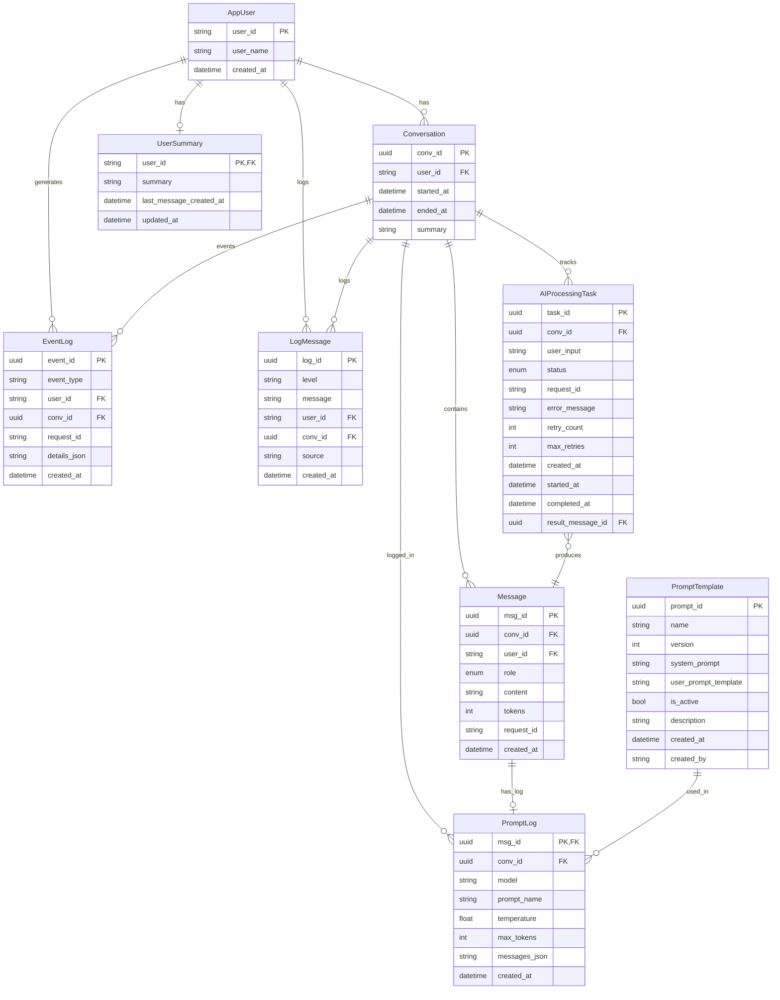

## 데이터베이스 스키마 상세 문서

본 문서는 현재 코드(`app/database/models.py`, `app/database/db.py`)를 기준으로 실제 운용 중인 DB 스키마, 컬럼/인덱스/제약, 테이블 간 관계, 처리 흐름, 샘플 쿼리, 운영 팁을 일괄 정리합니다.

### 개요

- **ORM/엔진**: SQLModel + SQLAlchemy AsyncEngine
- **세션 관리**: `AsyncSession` (expire_on_commit=False, autoflush=False, autocommit=False)
- **테이블 생성**: `init_db()`에서 `SQLModel.metadata.create_all`
- **풀 설정**: `pool_pre_ping`, `pool_size=10`, `max_overflow=20`, `pool_timeout=30s`, `pool_recycle=3600s`, `pool_reset_on_return='commit'`

---

## 열거형(Enums)

- **MessageRole**: `user` | `assistant` | `system`
- **AIProcessingStatus**: `pending` | `processing` | `completed` | `failed`

---

## 테이블 사양

### 1) AppUser

- **목적**: 외부(카카오 등)에서 전달된 사용자 식별자를 서비스 내부에서 일관 관리
- **컬럼**
  - `user_id` (PK, str, not null)
  - `user_name` (str, nullable, indexed) - 사용자 이름 (한글/영문 1~20자)
  - `created_at` (datetime, default: `KST now()`, indexed)
- **인덱스/제약**: PK(`user_id`), Index(`user_name`)
- **관계**: `AppUser (1) — (N) Conversation`, `AppUser (1) — (N) EventLog`, `AppUser (1) — (N) LogMessage`

### 2) Conversation

- **목적**: 사용자별 대화 세션(묶음) 관리. 요약/시작/종료 시각 보관
- **컬럼**
  - `conv_id` (PK, UUID, default: `uuid4()`)
  - `user_id` (FK -> `appuser.user_id`, not null, indexed)
  - `started_at` (datetime, default: `KST now()`, indexed)
  - `ended_at` (datetime, nullable)
  - `summary` (str, nullable)
- **인덱스/제약**: FK(`user_id`), Index(`user_id`, `started_at`)
- **관계**: `Conversation (1) — (N) Message`, `Conversation (1) — (N) AIProcessingTask`, `Conversation (1) — (N) PromptLog`, `Conversation (1) — (N) EventLog`, `Conversation (1) — (N) LogMessage`

### 3) Message

- **목적**: 대화의 개별 발화 로그(유저/어시스턴트/시스템)
- **컬럼**
  - `msg_id` (PK, UUID, default: `uuid4()`)
  - `conv_id` (FK -> `conversation.conv_id`, not null, indexed)
  - `user_id` (str, FK -> `appuser.user_id`, nullable, indexed)
  - `role` (enum MessageRole, not null, indexed)
  - `content` (str, not null)
  - `tokens` (int, nullable)
  - `request_id` (str, nullable, indexed)
  - `created_at` (datetime, default: `KST now()`, indexed)
- **인덱스/제약**: FK(`conv_id`), FK(`user_id`), Index(`conv_id`, `role`, `created_at`, `request_id`)
- **관계**: `Message (1) — (1) PromptLog` (1:1 관계)

### 4) AIProcessingTask

- **목적**: 비동기 AI 처리(큐잉/재시도/콜백) 상태 관리
- **컬럼**
  - `task_id` (PK, UUID, default: `uuid4()`)
  - `conv_id` (FK -> `conversation.conv_id`, not null, indexed)
  - `user_input` (str, not null)
  - `status` (enum AIProcessingStatus, default: `pending`, indexed)
  - `request_id` (str, nullable, indexed)
  - `error_message` (str, nullable)
  - `retry_count` (int, default: 0)
  - `max_retries` (int, default: 3)
  - `created_at` (datetime, default: `KST now()`, indexed)
  - `started_at` (datetime, nullable)
  - `completed_at` (datetime, nullable)
  - `result_message_id` (UUID, nullable, FK -> `message.msg_id`)
- **인덱스/제약**: FK(`conv_id`), FK(`result_message_id`), Index(`status`, `request_id`, `created_at`)
- **상태 전이**: `pending → processing → completed` 또는 `pending/processing → failed` (재시도 시 `retry_count` 증가)

### 5) PromptTemplate

- **목적**: 프롬프트 템플릿(시스템/유저 템플릿) 버전/활성 관리
- **컬럼**
  - `prompt_id` (PK, UUID, default: `uuid4()`)
  - `name` (str, not null, indexed)
  - `version` (int, default: 1, indexed)
  - `system_prompt` (str, not null)
  - `user_prompt_template` (str, nullable)
  - `is_active` (bool, default: true, indexed)
  - `description` (str, nullable)
  - `created_at` (datetime, default: `KST now()`, indexed)
  - `created_by` (str, nullable)
- **인덱스/제약**: Index(`name`, `version`, `is_active`, `created_at`)
- **비고**: `created_by`는 FK 아님(자유 텍스트)

### 6) PromptLog

- **목적**: 모델 호출 시점의 최종 메시지 배열 및 파라미터를 원본 그대로 감사(Audit) 로그로 저장
- **컬럼**
  - `msg_id` (PK, UUID, FK -> `message.msg_id`) - Message와 1:1 관계
  - `conv_id` (UUID, nullable, FK -> `conversation.conv_id`, indexed)
  - `model` (str, nullable)
  - `prompt_name` (str, nullable)
  - `temperature` (float, nullable)
  - `max_tokens` (int, nullable)
  - `messages_json` (str, not null) — 직렬화된 JSON 문자열
  - `created_at` (datetime, default: `KST now()`, indexed)
- **인덱스/제약**: PK가 동시에 FK, Index(`conv_id`, `created_at`)
- **비고**: Message와 1:1 관계로 통합, `log_id`와 `request_id` 제거됨

### 7) EventLog

- **목적**: 사용자 행동 및 시스템 이벤트 추적 (이름 변경, 대화 시작, 콜백 전송 등)
- **컬럼**
  - `event_id` (PK, UUID, default: `uuid4()`)
  - `event_type` (str, not null, indexed) - 이벤트 유형 (name_saved, name_wait_start 등)
  - `user_id` (str, FK -> `appuser.user_id`, nullable, indexed)
  - `conv_id` (UUID, FK -> `conversation.conv_id`, nullable, indexed)
  - `request_id` (str, nullable, indexed)
  - `details_json` (str, nullable) - JSON 형태의 상세 정보
  - `created_at` (datetime, default: `KST now()`, indexed)
- **인덱스/제약**: Index(`event_type`, `user_id`, `conv_id`, `created_at`)
- **비고**: 사용자 행동 패턴 분석 및 디버깅에 활용

### 8) LogMessage

- **목적**: 일반 애플리케이션 로그 메시지를 데이터베이스에 저장
- **컬럼**
  - `log_id` (PK, UUID, default: `uuid4()`)
  - `level` (str, not null, indexed) - 로그 레벨 (INFO, WARNING, ERROR, DEBUG)
  - `message` (str, not null) - 로그 메시지 내용
  - `user_id` (str, FK -> `appuser.user_id`, nullable, indexed)
  - `conv_id` (UUID, FK -> `conversation.conv_id`, nullable, indexed)
  - `source` (str, nullable) - 로그 발생 모듈/소스
  - `created_at` (datetime, default: `KST now()`, indexed)
- **인덱스/제약**: Index(`level`, `user_id`, `conv_id`, `created_at`)
- **비고**: 구조화된 로깅 및 모니터링에 활용

### 9) UserSummary

- **목적**: 사용자 단위로 누적 요약을 유지하고, 마지막 요약 반영 시점을 기록해 윈도우 롤업(20턴 등)을 관리
- **컬럼**
  - `user_id` (PK, FK -> `appuser.user_id`)
  - `summary` (str, nullable)
  - `last_message_created_at` (datetime, nullable)
  - `updated_at` (datetime, default: `KST now()`)
- **관계/인덱스**: PK가 FK, 1:1로 `AppUser`와 매핑

---

## 🆕 최신 스키마 변경사항 (2024년 8월)

### ✨ 추가된 기능
- **AppUser.user_name**: 사용자 이름 저장 및 관리
- **EventLog**: 사용자 행동 및 시스템 이벤트 추적
- **LogMessage**: 구조화된 로깅 시스템

### 🔄 변경된 스키마
- **PromptLog**: `log_id` 제거, `msg_id`를 primary key로 사용하여 Message와 1:1 관계
- **Message**: `user_id` 필드 추가로 직접적인 사용자 참조 가능
- **CounselSummary**: 테이블 제거됨 (기능 통합)

### 🗑️ 제거된 테이블
- **CounselSummary**: 상담 요약 기능이 UserSummary로 통합

---

## 테이블 관계(ER 다이어그램)



---

## 처리 흐름 요약

### A) 동기(즉시) 응답 경로
1. `/skill` 요청 수신 → `user_id`, `utterance` 파싱
2. `AppUser` upsert → 기존/신규 `Conversation` 확보
3. 시간 예산 내 모델 호출 시도 → 성공 시 즉시 응답 반환
4. `Message(user)`와 `Message(assistant)`를 백그라운드 태스크로 저장
5. 에러 또는 DB 장애 시에도 사용자 응답은 유지(로그/후처리)

### B) 콜백 경로(ENABLE_CALLBACK=True & 시간 부족)
1. 제한시간 내 미완료 → `{ "version":"2.0", "useCallback": true }` 즉시 반환
2. 백그라운드에서 모델 호출, `Message(assistant)` 저장
3. 콜백 HTTP POST로 최종 응답 전달
4. 상태 추적은 `AIProcessingTask.status`와 `request_id`로 트래킹

### C) 사용자 이름 관리 경로
1. 이름 패턴 감지 → `PendingNameCache` 상태 설정
2. 이름 추출 및 검증 → `AppUser.user_name` 업데이트
3. 이벤트 로깅 → `EventLog`에 이름 변경 이벤트 기록
4. 로그 메시지 → `LogMessage`에 이름 변경 완료 로그 저장

---

## 샘플 쿼리/패턴

> 아래는 SQLModel/SQLAlchemy로 표현되는 동작의 의사 코드입니다.

### 1) 대화 시작/메시지 기록
```python
# AppUser upsert (존재 시 skip)
session.add(AppUser(user_id=user_id))

# Conversation 생성 또는 조회
conv = Conversation(user_id=user_id)
session.add(conv)
await session.flush()  # conv_id 확보

# 유저 메시지 기록
session.add(Message(conv_id=conv.conv_id, user_id=user_id, role=MessageRole.USER, content=utterance))
```

### 2) 비동기 작업 생성/완료 처리
```python
# 작업 생성(pending)
task = AIProcessingTask(conv_id=conv.conv_id, user_input=utterance)
session.add(task)

# 처리 시작 → 완료 시 결과 메시지 연결
assistant_msg = Message(conv_id=conv.conv_id, user_id=user_id, role=MessageRole.ASSISTANT, content=answer)
session.add(assistant_msg)
await session.flush()  # msg_id 확보

task.status = AIProcessingStatus.COMPLETED
task.result_message_id = assistant_msg.msg_id
```

### 3) 사용자 이름 관리
```python
# 사용자 이름 업데이트
user = await session.get(AppUser, user_id)
if user:
    user.user_name = new_name
    # 이벤트 로그 저장
    session.add(EventLog(
        event_type="name_saved",
        user_id=user_id,
        details_json=json.dumps({"name": new_name, "mode": "update"})
    ))
    # 로그 메시지 저장
    session.add(LogMessage(
        level="INFO",
        message=f"사용자 이름이 '{new_name}'으로 변경되었습니다.",
        user_id=user_id,
        source="name_update"
    ))
```

### 4) 감사 로그 저장 (새로운 1:1 관계)
```python
# Message 저장 후 PromptLog 연결
msg = Message(conv_id=conv.conv_id, user_id=user_id, role=MessageRole.ASSISTANT, content=content)
session.add(msg)
await session.flush()  # msg_id 확보

# PromptLog는 Message의 msg_id를 primary key로 사용
session.add(PromptLog(
    msg_id=msg.msg_id,  # 1:1 관계
    conv_id=conv.conv_id,
    model=model,
    prompt_name=prompt_name,
    temperature=temperature,
    max_tokens=max_tokens,
    messages_json=json.dumps(messages, ensure_ascii=False),
))
```

### 5) 사용자 요약 저장
```python
session.add(UserSummary(
    user_id=user_id,
    summary=summary_text,
    last_message_created_at=last_message_time,
))
```

---

## 성능/운영 노트

- **인덱스 활용**: 질의 패턴에 따라 `created_at`, `request_id`, `status`, `user_id` 복합 인덱스를 적극 활용
- **장애 내성**: DB 오류 시 사용자 응답을 우선. 실패한 기록은 재처리 큐 또는 운영 로그로 보전
- **세션 수명**: 요청/백그라운드 태스크 각각 독립 `AsyncSession` 사용 권장
- **보존 정책**: `PromptLog`, `Message`는 용량 증가속도가 빠름. 파티셔닝 또는 주기적 보관/삭제 정책 고려
- **호환성**: DB 벤더에 따라 enum/uuid가 네이티브/텍스트로 저장될 수 있음. 마이그레이션 시 주의
- **로깅 최적화**: `LogMessage` 테이블은 로그 레벨별 인덱스로 효율적인 쿼리 지원
- **이름 관리**: `AppUser.user_name` 인덱스로 빠른 이름 검색 및 변경 지원

---

## 초기화/세션 관리 참고(`app/database/db.py`)

- `create_async_engine(settings.database_url, pool_pre_ping=True, pool_size=10, max_overflow=20, ...)`
- `init_db()`에서 테이블 자동 생성
- `get_session()` 제너레이터로 안전한 세션 획득/반환/rollback 보장
- `expire_on_commit=False` 설정으로 ORM 객체 속성 만료 방지

---

## 🆕 새로운 기능 활용 예시

### 이름 관리 API 테스트
```bash
# 이름 추출 테스트
curl -X POST "http://localhost:8000/test-name-extraction" \
-H "Content-Type: application/json" \
-d '{"text": "내 이름은 민수야"}'

# 응답 예시
{
  "status": "success",
  "result": {
    "original": "내 이름은 민수야",
    "extracted_name": "민수",
    "cleaned_name": "민수",
    "is_valid": true
  }
}
```

### 이벤트 로그 조회
```sql
-- 사용자별 이름 변경 이벤트 조회
SELECT event_type, details_json, created_at 
FROM eventlog 
WHERE user_id = 'user123' AND event_type LIKE 'name_%'
ORDER BY created_at DESC;
```

---

문의/개선 제안은 문서 PR로 환영합니다.

